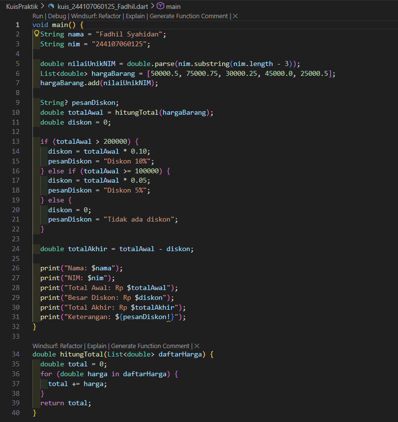
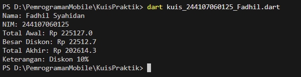
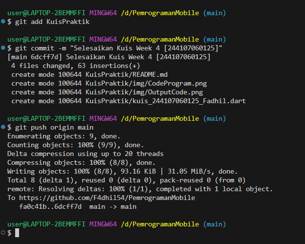

# Laporan Kuis Praktikum #01 - Sistem Pengolah Diskon Toko Terpersonalisasi

## Identitas Mahasiswa

| Atribut | Nilai                        |
| ------- | -----                        |
| Nama    | Fadhil Syahidan Arizki       |
| NIM     | 244107060125                 |
| Kelas   | SIB-2F                       |

---

## Kuis Praktikum 1

### Hasil Kuis Praktikum

Berikut adalah hasil output dari code yang di tugaskan pada soal yang ada di pdf : 

## Penjelasan Singkat Tentang Code
Program ini menghitung total belanja dari beberapa harga barang yang disimpan dalam List<double>.
Tiga digit terakhir NIM diambil menggunakan substring() lalu dikonversi menjadi double dan dimasukkan ke dalam list sebagai nilai tambahan. Nilai ini membuat total belanja setiap mahasiswa berbeda.

Total belanja dihitung menggunakan fungsi hitungTotal() dengan perulangan for-in.
Setelah total didapatkan, program menentukan diskon:

200000 → diskon 10%

100000 – 200000 → diskon 5%

< 100000 → tidak ada diskon

Variabel String? pesanDiskon menggunakan fitur null safety dan dicetak menggunakan operator ! setelah dipastikan memiliki nilai.

> **Catatan:** Semua komponen telah terpasang dengan baik dan tidak ada issue yang ditemukan (`No issues found!`).