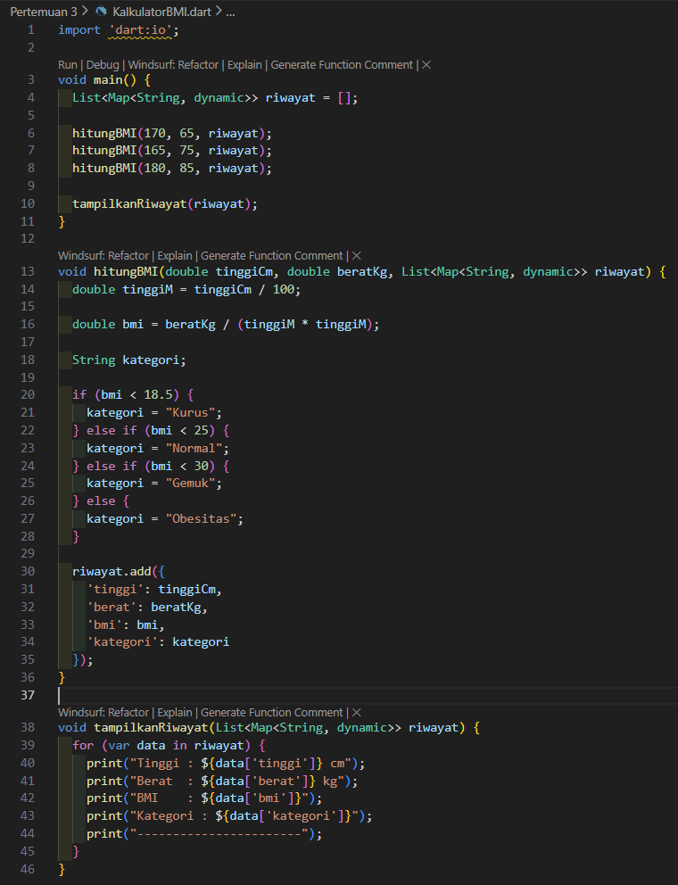
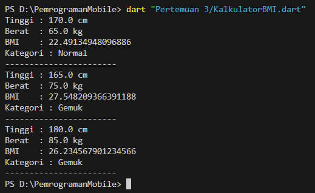
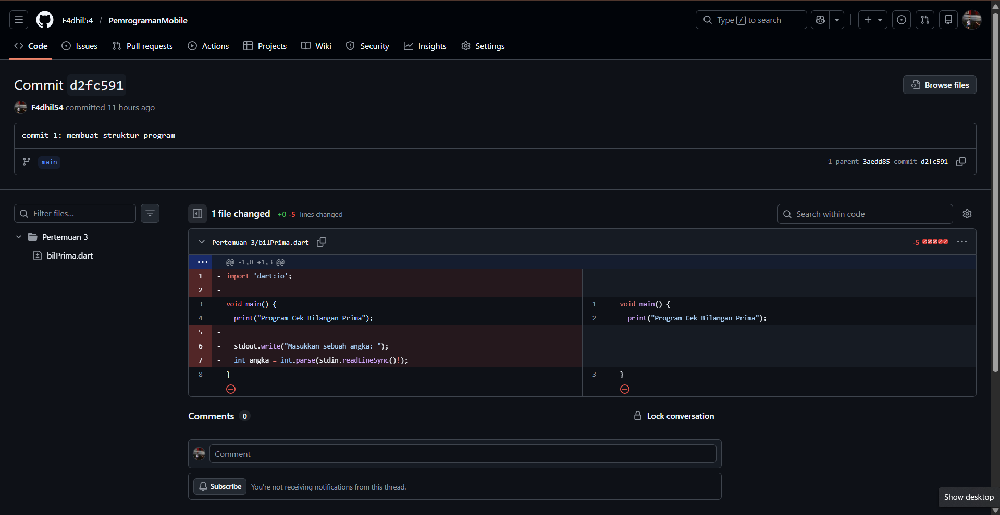
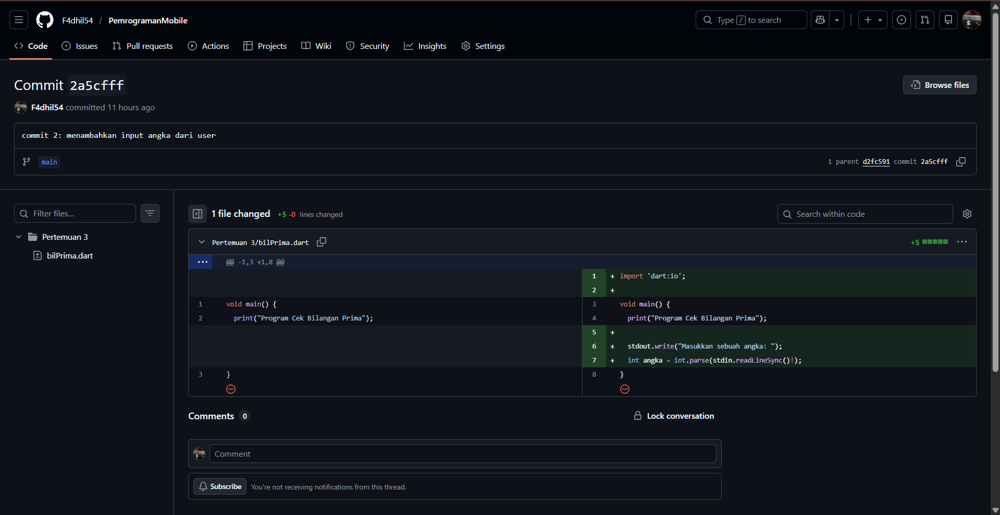
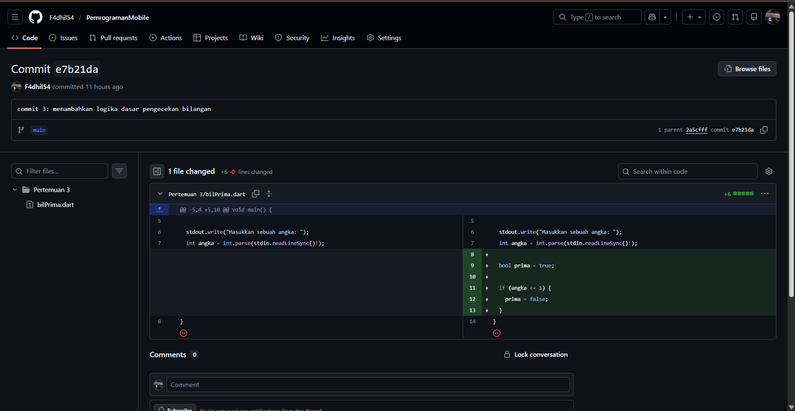
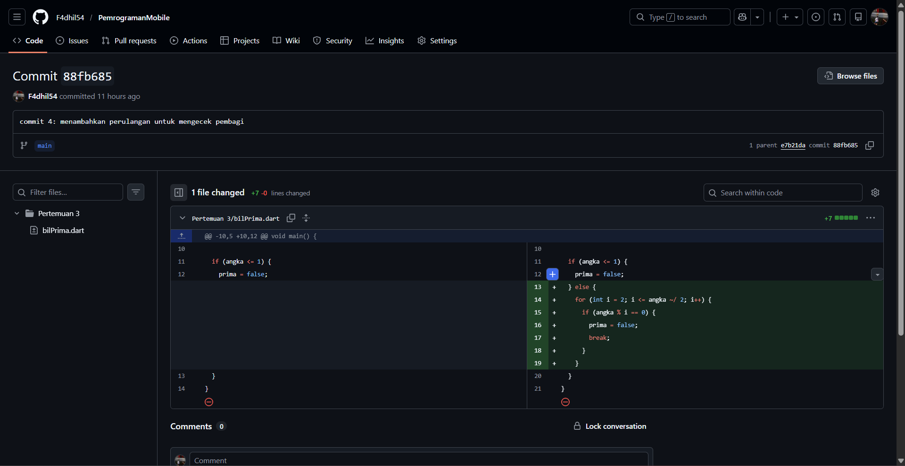
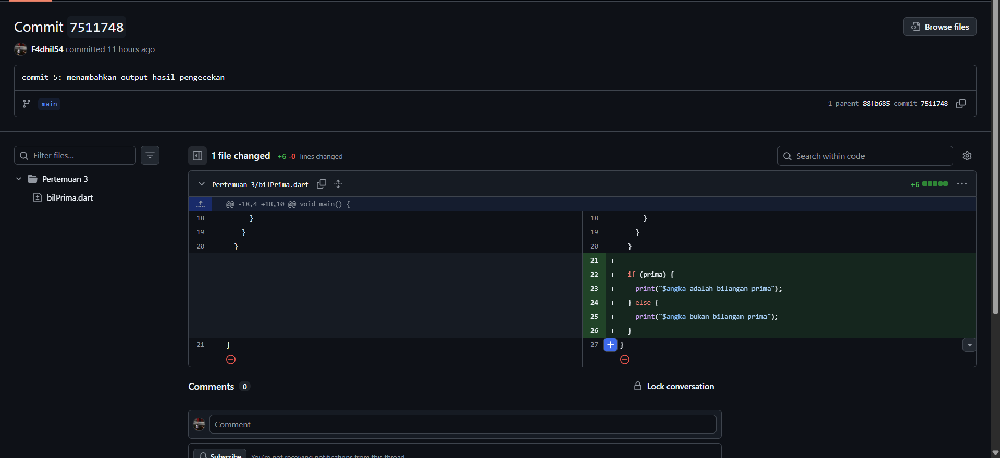

# Laporan Praktikum #03 - Percabangan, Perulangan, dan Operasi Git Lanjutan pada Dart

## Identitas Mahasiswa

| Atribut | Nilai                        |
| ------- | -----                        |
| Nama    | Fadhil Syahidan Arizki  |
| NIM     | 244107060125                 |
| Kelas   | SIB-2F                       |

---

## Tugas Praktikum 3

### Hasil tugas individual

Berikut adalah hasil dari code yang di tugaskan pada pdf

> **Catatan:** Semua code berjalan dengan lancar masih belum ada error (`No issues found!`).