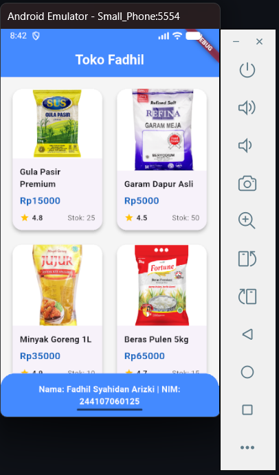
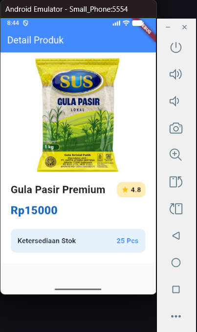

# 📱 Laporan Praktikum Flutter - Navigasi Multi Halaman

## Identitas Mahasiswa

| Atribut | Nilai                        |
| ------- | -----                        |
| Nama    | Fadhil Syahidan Arizki       |
| NIM     | 244107060125                 |
| ABSEN   | 08                           |
| Kelas   | SIB-2F                       | 

---

## 🚀 Praktikum 5: Membangun Navigasi di Flutter

Pada praktikum ini, saya membuat aplikasi sederhana berupa daftar barang sembako dengan fitur menampilkan list produk, navigasi ke halaman detail, serta mengirim data antar halaman.

---

## 🔀 Langkah 1: Setup Navigasi (Route)

Menggunakan go_router untuk navigasi:

- / → HomePage
- /item → ItemPage
Navigasi dilakukan dengan:

context.go('/item', extra: item);

---

## 📦 Langkah 2: Membuat Data Model

Membuat model Item yang berisi:

- nama produk
- harga
- gambar
- stok
- rating

## 🏠 Langkah 3: Halaman HomePage
Menampilkan daftar produk menggunakan GridView seperti aplikasi marketplace.

Fitur:

- Card produk
- Gambar produk
- Harga
- Rating
- Stok
- Klik item → pindah ke halaman detail

📸 Hasil HomePage:

---

## 📄 Langkah 4: Halaman ItemPage

Menampilkan detail produk dari item yang dipilih.

Fitur:

- Gambar besar
- Nama produk
- Harga
- Rating
- Stok
- Hero animation

📸 Hasil Detail Page:

---