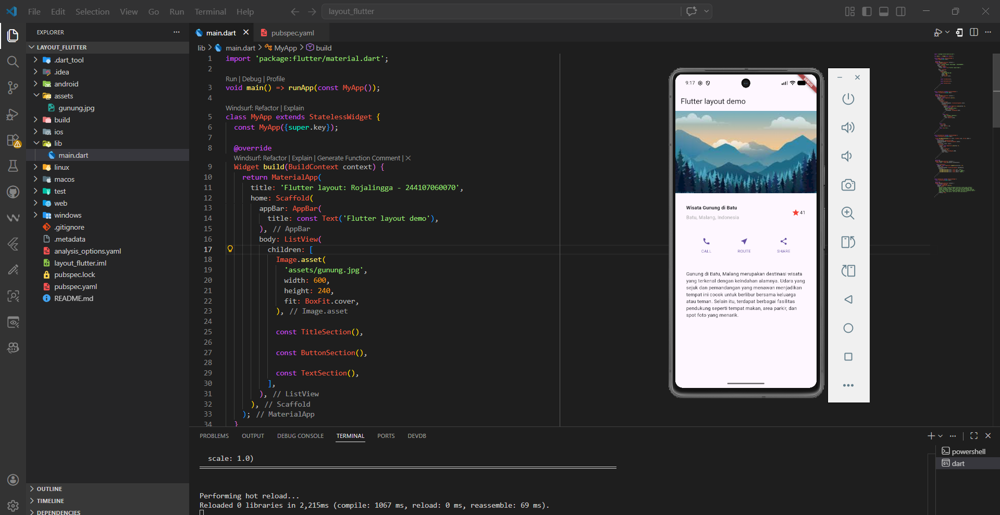
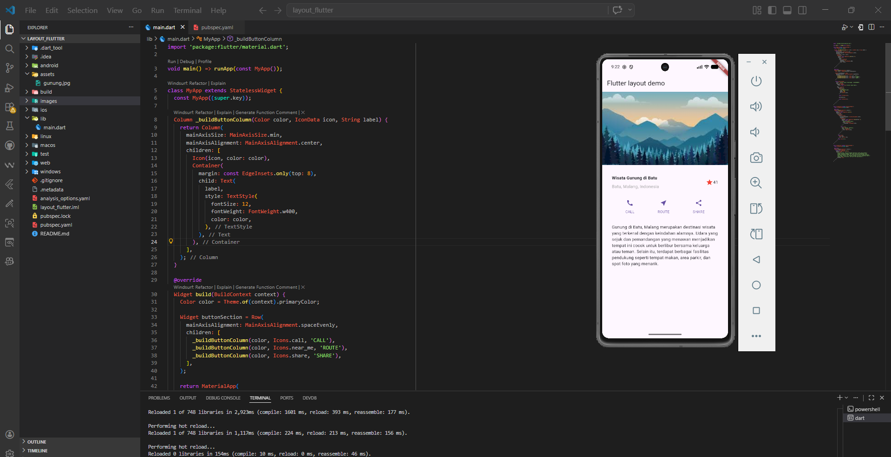
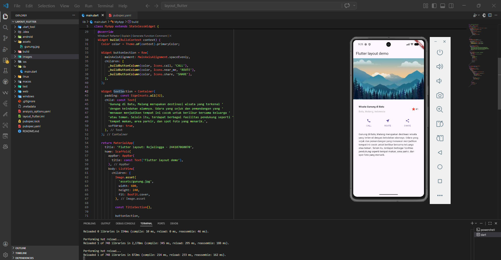
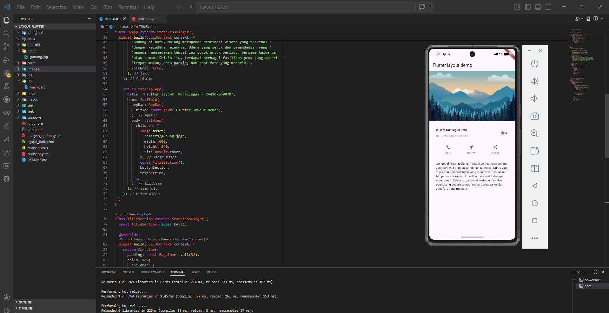

# 📱 Laporan Praktikum Flutter Jobsheet 2 - Layout Di Flutter

## Identitas Mahasiswa

| Atribut | Nilai                        |
| ------- | -----                        |
| Nama    | Fadhil Syahidan Arizki       |
| NIM     | 244107060125                 |
| ABSEN   | 08                           |
| Kelas   | SIB-2F                       | 

---

## 🚀 Praktikum 1: Membangun Layout di Flutter

Pada praktikum ini, saya mulai memahami bagaimana cara kerja layout di Flutter.
Saya membuat struktur dasar aplikasi menggunakan MaterialApp dan Scaffold, serta menampilkan tampilan sederhana sebagai dasar pengembangan UI.

📸 Hasil:

---

## 🔘 Praktikum 2: Implementasi Button Row

Pada tahap ini, saya membuat bagian tombol (button section) yang terdiri dari 3 tombol:

- CALL
- ROUTE
- SHARE

Setiap tombol dibuat menggunakan kombinasi widget Column, Icon, dan Text, lalu disusun dalam Row dengan jarak yang merata menggunakan MainAxisAlignment.spaceEvenly.

Pendekatan ini membantu memahami konsep reusable widget melalui fungsi _buildButtonColumn.

📸 Hasil : 

---

## 📝 Praktikum 3: Implementasi Text Section

Pada langkah ini, saya menambahkan bagian deskripsi (text section) menggunakan widget Container dan Text.

Beberapa hal yang dipelajari:

- Penggunaan padding untuk memberi jarak
- Properti softWrap agar teks otomatis menyesuaikan lebar layar
- Penyusunan layout yang lebih rapi dan readable

📸 Hasil:

---

## 🖼️ Praktikum 4: Implementasi Image Section

Pada praktikum ini, saya menambahkan gambar dari folder assets menggunakan Image.asset.

Beberapa poin penting:

- Menggunakan BoxFit.cover agar gambar menyesuaikan ukuran container dan tetap memenuhi area
- Mengatur ukuran gambar dengan width dan height
- Menggunakan ListView agar tampilan bisa di-scroll pada berbagai ukuran layar

📸 Hasil:

---